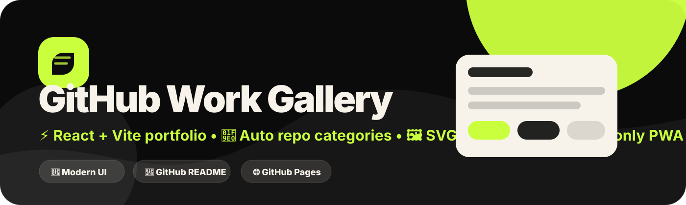

<p align="center">
  
</p>

# 📘 Full A-Z Guide — GitHub Work Gallery

> ✨ This guide explains everything: setup, config, GitHub repos, categories, icons, README preview, PWA install, GitHub Pages deploy, and update workflow.

---

## 🧭 1. Project overview

**GitHub Work Gallery** is a modern portfolio/gallery app that shows your public GitHub repositories in a clean UI.

It supports:

- 🌐 Live GitHub repo loading
- 🔗 Selected repo link loading
- 🧠 Automatic category detection
- 🎯 Automatic icon detection
- 📘 GitHub-style README preview
- 🖼️ Automatic repo preview SVG covers
- 📱 Online-only PWA install method
- 🚀 GitHub Pages deployment
- 🌗 Day/dark theme UI
- 📲 Mobile-first responsive design

---

## 🛠️ 2. Requirements

| Tool | Version / note |
|---|---|
| 🟢 Node.js | `18.18.0` or newer |
| 📦 PNPM | `9.15.4` recommended |
| 🧬 Git | Needed for GitHub push |
| 🌐 GitHub account | Needed for live public repos and Pages deploy |

---

## ⚡ 3. Install and run

```bash
corepack enable
corepack prepare pnpm@9.15.4 --activate
pnpm install
pnpm dev
```

Then open the Vite local URL in your browser.

---

## 🧑‍💼 4. Edit profile details

Open:

```txt
src/config/site.config.js
```

Edit this section:

```js
profile: {
  name: 'Tharindu Prabath',
  role: 'Mobile & Web Developer • UI/UX Builder',
  location: 'Sri Lanka',
  email: 'prabath99t@gmail.com',
  avatar: 'https://avatars.githubusercontent.com/u/116081100?v=4'
}
```

Useful fields:

- 🧑 `name` — profile card name
- 💼 `role` — subtitle under name
- 📍 `location` — visible location text
- 📧 `email` — contact email
- 🖼️ `avatar` — GitHub/profile image URL
- 🧩 `skills` — progress bars in profile sidebar

---

## 🔗 5. Edit contact links

Open:

```txt
src/config/site.config.js
```

Edit the `links` array:

```js
links: [
  {
    label: 'GitHub',
    icon: 'github',
    url: 'https://github.com/tharindu899',
    note: 'Public repositories and releases'
  }
]
```

Supported common icon names:

```txt
github, mail, globe, telegram, whatsapp, linkedin, instagram, youtube
```

---

## 📦 6. Load GitHub repositories

### 🟢 Method 1 — all public repos

Open:

```txt
src/config/site.config.js
```

Set:

```js
githubUsername: 'tharindu899'
```

This also works:

```js
githubUsername: 'https://github.com/tharindu899'
```

### 🟣 Method 2 — selected repo links only

Open:

```txt
src/config/projects.config.js
```

Set:

```js
export const repositoryLinks = [
  'https://github.com/tharindu899/CashNest_X',
  'tharindu899/Inkwell'
];
```

Advanced selected repo method:

```js
export const repositoryLinks = [
  {
    url: 'https://github.com/tharindu899/MyRepo',
    featured: true,
    photo: 'images/projects/my-repo.png'
  }
];
```


---

## 📌 6.1. Home pinned item limit

Home page shows only **pinned project items**, capped to **3**, plus **3 focus/method cards** so the layout stays clean on mobile.

Open:

```txt
src/config/site.config.js
```

Set:

```js
ui: {
  pinnedProjectLimit: 3,
  workItemLimit: 3
}
```

- 📌 `pinnedProjectLimit: 3` means only 3 pinned/featured repos show on Home.
- 🧩 `workItemLimit: 3` means only 3 method/focus cards show on Home.
- 🗂️ The Projects page still shows all loaded repos.
- ✅ Pinned badges show on Home and Projects page for repos with `featured: true`.
- ✅ The Projects page is not limited; it still shows every loaded repo.

### ✅ 6.2. CashNest X pin fix

Use the real GitHub repo slug as the override key. For **CashNest X**, that is usually `CashNest_X`:

```js
export const projectOverrides = {
  CashNest_X: {
    title: 'CashNest X',
    aliases: ['CashNest', 'CashNest X', 'cashnest-x'],
    featured: true,
    category: 'finance',
    icon: 'piggy'
  }
};
```

The matcher now checks:

- 🏷️ Real repo name: `CashNest_X`
- ✨ Display title: `CashNest X`
- 🔁 Aliases: `CashNest`, `cashnest-x`
- 👤 Owner/repo format: `tharindu899/CashNest_X`
---

## 🧠 7. Automatic category detection

The app checks repo name, description, topics, homepage, and language.

| Category | Icon idea | Keywords |
|---|---|---|
| 💰 `finance` | wallet / piggy / money | cash, money, expense, loan, wallet, budget |
| 🎬 `media` | film | movie, anime, stream, video, TMDb, Telegram |
| 🤖 `android` | android | android, apk, kotlin, java, capacitor, compose |
| 🌐 `web` | react / globe | react, vite, portfolio, dashboard, pwa, html, css |
| ⚡ `automation` | bolt / terminal | workflow, actions, deploy, script, docker, bot, termux |
| 🧰 `tools` | code / terminal | fallback category |

---

## 🎯 8. Manual project override

Use overrides when automatic detection is not enough.

Open:

```txt
src/config/projects.config.js
```

Example:

```js
export const projectOverrides = {
  CashNest_X: {
    title: 'CashNest X',
    category: 'finance',
    featured: true,
    icon: 'piggy',
    photo: 'images/projects/cashnest-x.png',
    shortNote: 'Mobile-first personal finance tracker.',
    note: 'Finance tracker with backup, reports, and release workflow.',
    tags: ['React', 'Capacitor', 'Finance'],
    status: 'Active'
  }
};
```

Override keys can be:

- 🏷️ Exact repo name: `CashNest_X`
- 👤 Owner/repo: `tharindu899/CashNest_X`
- 🔗 Full URL: `https://github.com/tharindu899/CashNest_X`

---

## 🖼️ 9. Project photos and automatic SVG previews

### ✅ Automatic preview

When no image is added, the app creates a matching SVG preview automatically.

It includes:

- 🏷️ Project title
- 👤 Owner/repo
- 🧭 Category
- 💻 Language
- ⭐ Stars
- 🍴 Forks
- 🚦 Status
- 🧩 Tags

### ✅ Custom screenshot preview

Put images inside:

```txt
public/images/projects/
```

Then set:

```js
MyRepo: {
  photo: 'images/projects/my-repo.png'
}
```

Multiple images:

```js
MyRepo: {
  photos: [
    'images/projects/my-repo.png',
    'images/projects/gallery/screen-1.png'
  ]
}
```

---

## 📘 10. README preview

The details page loads the repository README and displays it in GitHub-like style.

Features:

- 🧾 GitHub-style markdown body
- 🧱 Code blocks
- 📊 Tables
- ✅ Task lists
- 🔗 Links
- 🌗 Light/dark mode support
- 📱 Mobile scroll fixes

Main files:

```txt
src/components/ReadmeViewer.jsx
src/utils/github.js
src/styles/index.css
```

---

## 📱 11. Online-only PWA

This app is installable, but stays online-only.

That means:

- ✅ No precached app shell
- ✅ No stale README data
- ✅ No stale GitHub API data
- ✅ No old UI after deploy
- ✅ Fresh network request every time

Main files:

```txt
public/manifest.webmanifest
public/sw.js
src/pwa/registerOnlineOnlyPwa.js
src/pwa/usePwaInstallPrompt.js
src/components/PwaInstallButton.jsx
```

---

## 🚀 12. Build

```bash
pnpm build
```

Output folder:

```txt
dist/
```

---

## 🌐 13. Deploy to GitHub Pages

1. 📤 Push the repo to GitHub.
2. ⚙️ Open **Settings → Pages**.
3. 🧪 Choose **GitHub Actions**.
4. 🌿 Push to `main` or `master`.
5. ✅ GitHub Actions deploys the site.

Workflow file:

```txt
.github/workflows/pages.yml
```

---

## 🧪 14. Test checklist

Before release, check:

- ✅ Home page opens
- ✅ Projects page loads repos
- ✅ Contact page buttons work
- ✅ README preview opens
- ✅ Back button works
- ✅ Theme toggle works
- ✅ PWA install button appears where supported
- ✅ No stale cache after redeploy
- ✅ Mobile layout looks correct

---

## 🧩 15. Update workflow

After editing files:

```bash
git add .
git commit -m "update modern docs and portfolio config"
git push
```

Or use your push script:

```bash
./push.sh "update modern readme docs; add emoji structure; improve setup guides"
```
